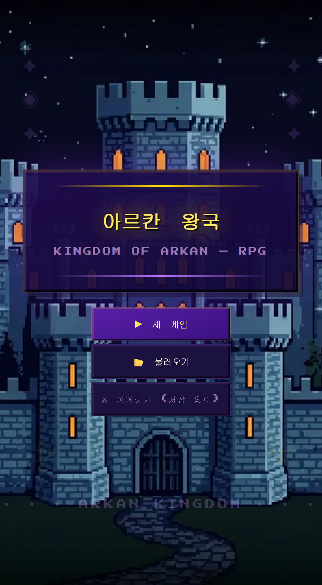
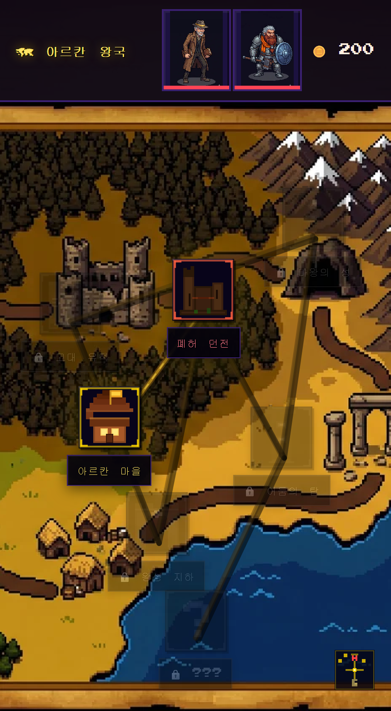
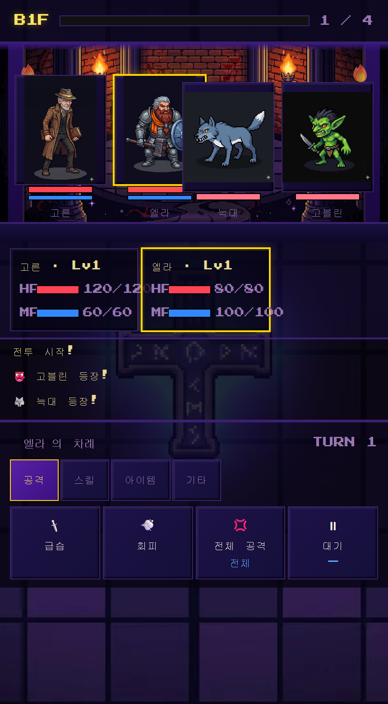

# ⚔ 아르칸: 잊혀진 왕좌 — Kingdom of Arkan RPG
### 🎮 [▶ 지금 바로 플레이하기](https://coding-jhj.github.io/ARKAN_FORGOTTEN_THRONE/)
[](https://coding-jhj.github.io/ARKAN_FORGOTTEN_THRONE/)
[](https://coding-jhj.github.io/ARKAN_FORGOTTEN_THRONE/)


<p align="center">
  
  
  
</p>
<p align="center"><sub>📱 모바일 반응형 · 픽셀 아트 · 빌드 없는 정적 사이트</sub></p>
> *왕좌는 잊혀졌고, 왕국은 어둠에 잠겼다.*  
> *여덟 명의 영웅이 다시 빛을 찾아 나선다.*
---
## 📖 스토리
아르칸 왕국의 왕좌가 사라진 지 100년.  
전설 속 유물 **"잊혀진 왕좌"** 를 되찾으려는 음모가 왕국 곳곳에서 꿈틀댄다.

대장장이, 시녀, 용병, 마법사... 서로 다른 이유로 모인 여덟 명의 영웅이  
마을에서 시작해 폐허와 어둠의 탑을 넘어 진실에 다가간다.

---
## 🧑‍🤝‍🧑 등장 캐릭터
| 캐릭터 | 직업 | 속성 | 고유 스킬 |
|--------|------|------|-----------|
| ⚒ **고른** | 대장장이 (전사) | 🔥 화염 | 분노의 일격 · 철벽 |
| 🗡 **엘라** | 왕궁 시녀 (도적) | 💨 바람 | 독 바늘 · 현혹 |
| 🍺 **머독** | 비밀 장부 (도적) | 🌑 암흑 | 뒤통수 · 정보 거래 |
| 🛡 **세라** | 전직 기사·용병 (기사) | ❄ 냉기 | 방패 격돌 · 성역 |
| 🔮 **피우** | 마법사 조수 (마법사) | ⚡ 번개 | 마법 미사일 · 과부하 |
| 🪓 **카그** | 족장 경호원 (전사) | 🌿 대지 | 대지 격분 · 위협 |
| 🏹 **리라** | 엘프 레인저 (도적) | 🌬 바람 | 폭풍 화살 · 마비 화살 |
| ⚔ **자인** | 다크 나이트 (기사) | 🌑 어둠 | 어둠의 참격 · 죽음의 선고 |

---
## 🗺 게임 화면
| 화면 | 설명 |
|------|------|
| 🗺 **월드맵** | 왕국 지도에서 마을·던전 이동 |
| 🏘 **마을** | 길드·상점·NPC·도감 진입 |
| ⚔ **길드** | 파티 편성 (최대 3인) |
| 🛒 **상점** | 무기·방어구·포션 구매 |
| 💬 **NPC** | 마을 장로와 대화·퀘스트 수락 |
| 🥊 **배틀** | 턴제 전투 (행동·스킬·아이템) |
| 📊 **스탯** | 캐릭터 능력치·장비 확인 |
| 📖 **인물도감** | 영웅·몬스터 도감 열람 |
| ⚒ **대장간** | 장비 강화 · 재료 합성 |

---
## 🗼 던전
| 던전 | 설명 |
|------|------|
| ⚔ **폐허 던전** | 왕국 외곽의 버려진 성터. 초반 공략 지역. |
| 🗼 **어둠의 탑** | 봉인된 마력이 넘치는 고난이도 던전. |
| ❓ **???** | 아직 베일에 싸인 세 번째 지역. |

---
## ⚙ 전투 시스템
```
턴제 커맨드 배틀
├── 행동 탭  : 기본 공격 / 방어
├── 스킬 탭  : 캐릭터 고유 스킬 (MP 소모, 쿨다운)
└── 아이템 탭: 포션·에테르 사용
```
- 파티 3인 vs 적 2~3인 구성
- HP 0 → 전투 불능 / 전원 전투 불능 시 패배
- 승리 시 골드·경험치 획득 → 레벨업 → 스탯 성장

---
## 🛠 기술 스택
```
HTML5 / CSS3 / Vanilla JavaScript
├── Canvas API     — 마인크래프트 스타일 픽셀 블록 배경
├── Press Start 2P — 픽셀 폰트 (Google Fonts)
├── 모듈 분리       — HTML / CSS / JS(데이터·로직·배경) 파일 분리
├── 빌드 불필요     — 외부 런타임 의존성 없음, 정적 호스팅(GitHub Pages)
├── 반응형 UI      — 모바일 뷰포트(100dvh) · ≤480px 1열 레이아웃 자동 전환
└── 헤드리스 QA    — Playwright 상태단언 테스트(전투·게이팅·세이브·반응형)
```

---
## 🚀 로컬 실행
```bash
git clone https://github.com/coding-jhj/ARKAN_FORGOTTEN_THRONE.git
cd ARKAN_FORGOTTEN_THRONE
# 정적 서버로 실행 (권장)
python -m http.server 8000   # → http://localhost:8000/index.html
# 또는 index.html 을 브라우저로 직접 열기
```

---
## 📁 파일 구조
```
ARKAN_FORGOTTEN_THRONE/
├── index.html              ← 엔트리 (마크업 + 에셋/스크립트 로드)
├── css/
│   └── styles.css          ← 전체 스타일
├── js/
│   ├── sprites.js          ← 적 스프라이트 맵
│   ├── data.js             ← 게임 데이터 (파티·아이템·적·던전·NPC·맵)
│   ├── game.js             ← 게임 로직 (화면·길드·상점·파티·전투·세이브·도감)
│   └── background.js       ← 절차적 픽셀아트 배경 렌더러
├── assets/
│   └── sprites/            ← 추출된 픽셀 스프라이트 (webp/jpg)
├── docs/
│   └── screenshots/        ← README 스크린샷
└── README.md
```

---
*© 2026 coding-jhj · Made with ❤ and Pixel Art*
